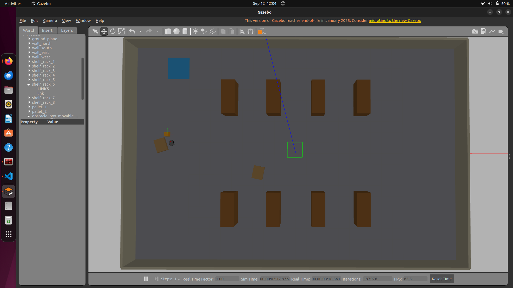
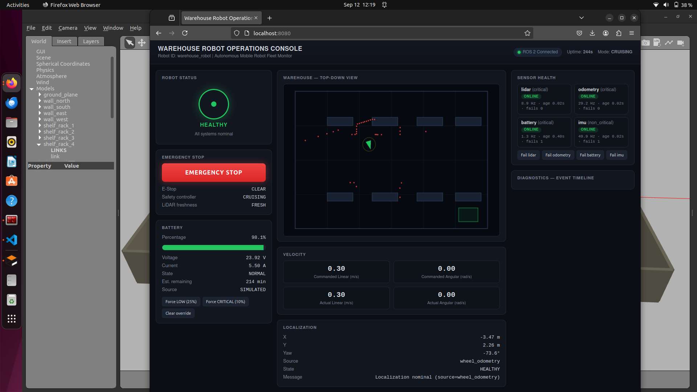
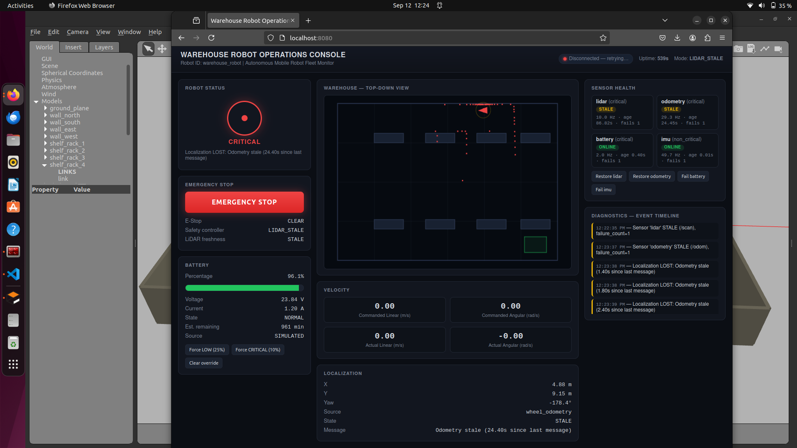

# ROS 2 Autonomous Warehouse Robot

A ROS 2 warehouse robot simulation focused on **safety, sensor monitoring, fault handling, battery management, and a real-time dashboard**.

The project demonstrates how an AMR can safely respond when sensors or system components fail.

## Features

* 🚗 Differential-drive warehouse robot
* 📡 LiDAR-based obstacle detection
* 🛑 Automatic obstacle slowdown and stop
* 🚨 E-stop with controlled reset
* 🔧 Sensor fault injection and recovery
* 🔋 Battery monitoring and low-battery speed control
* ❤️ Robot health monitoring
* 📍 Odometry and localization monitoring
* 🌐 FastAPI + WebSocket dashboard
* 🔄 Automatic dashboard reconnect

## Screenshots

### Gazebo Warehouse Simulation



The robot running inside the simulated warehouse environment.

### Live Robot Dashboard



The web dashboard showing robot health, battery status, safety state, and LiDAR visualization.

### Sensor Fault Handling



Example of the system detecting a sensor failure and moving the robot into a safe state.

## Safety Flow

```text
Sensors
   ↓
Health Monitoring
   ↓
Safety Controller
   ↓
/cmd_vel
   ↓
Robot
```

The `safety_controller` is the final authority over robot motion.

It monitors:

* E-stop
* LiDAR freshness
* Odometry freshness
* Battery communication
* Battery level
* Obstacle distance

### Obstacle Behavior

```text
> 1.0 m       → Normal speed
0.45–1.0 m   → Slow down
≤ 0.45 m     → Stop
```

Normal cruise speed: **0.3 m/s**

## Fault Testing

Sensor failures can be injected without disconnecting hardware.

Example:

```bash
ros2 service call /fault/set_sensor_fault \
warehouse_robot_msgs/srv/SetSensorFault \
"{sensor_name: 'lidar', fault_enabled: true}"
```

The robot detects the failure, stops safely, and can recover when the fault is cleared.

## Packages

```text
src/
├── warehouse_robot_bringup
├── warehouse_robot_control
├── warehouse_robot_dashboard
├── warehouse_robot_description
└── warehouse_robot_msgs
```

### Main components

**Control**

* Safety controller
* E-stop manager
* Battery manager
* Health aggregator
* Localization monitor
* Sensor heartbeat monitor
* Fault injector

**Dashboard**

* FastAPI
* WebSockets
* ROS dashboard bridge
* Live robot status

**Description**

* URDF
* LiDAR
* IMU
* Differential drive
* Gazebo warehouse

**Messages**

* Battery
* Health
* Sensor status
* Localization
* E-stop
* Fault injection

## Testing

Validated in **ROS 2 Humble + Gazebo Classic 11.10.2**.

```text
Clean workspace build     ✅
Safety logic tests        34 passed
Dashboard tests             7 passed
Combined application       41 passed
```

Safety scenarios tested:

```text
Normal movement             ✅
Obstacle slowdown           ✅
Obstacle hard stop          ✅
LiDAR failure/recovery      ✅
Odometry failure/recovery   ✅
Battery failure/recovery    ✅
IMU fault detection         ✅
E-stop activation/reset     ✅
Dashboard disconnect        ✅
Dashboard reconnect         ✅
```

## Build & Run

```bash
cd ~/wh_robot_ws
source /opt/ros/humble/setup.bash
colcon build --symlink-install
source install/setup.bash

ros2 launch warehouse_robot_bringup warehouse_robot.launch.py
```

Dashboard:

```text
http://localhost:8080
```

## Current Limitations

* Simulation only
* Wheel odometry is the current localization source
* Battery values are simulated
* Full Nav2 stack is not included
* Hardware safety validation is not yet performed

## Future Work

* Nav2 navigation
* Fused localization
* Real robot hardware
* Multi-robot fleet coordination
* Mission management
* Hardware-in-the-loop testing
* CI pipeline

## Project Goal

> **What should the robot do when something goes wrong?**

This project focuses on building that safety behavior into a complete ROS 2 warehouse robot system.
