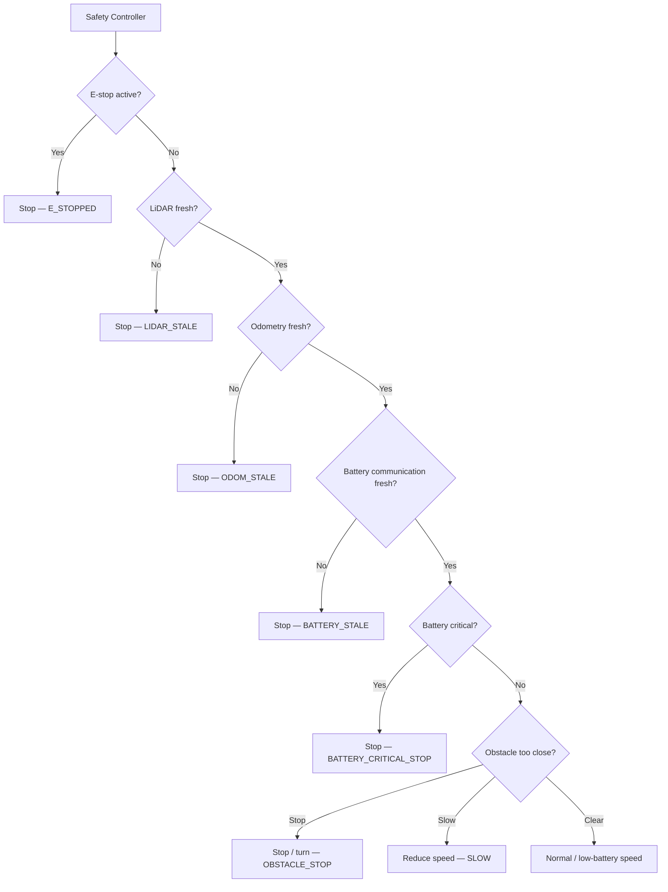
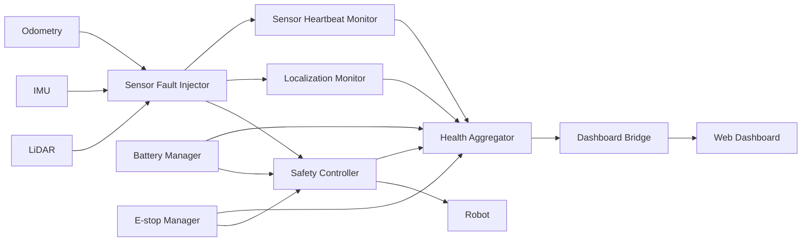
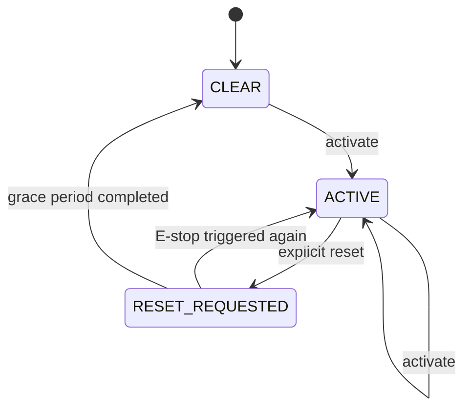
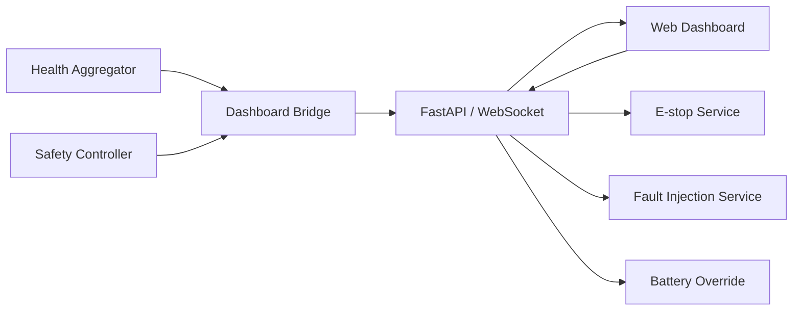

# System Architecture

This document gives a simple overview of how the main parts of the warehouse robot work together.

The project is divided into five ROS 2 packages, with the safety controller responsible for making the final motion decision.

## 1. Safety Architecture

The `safety_controller` is the only node that publishes the final `/cmd_vel` command.

Every control cycle, it checks the safety conditions in this order:

```text
E-stop
   ↓
LiDAR health
   ↓
Odometry health
   ↓
Battery communication
   ↓
Critical battery
   ↓
Obstacle distance
   ↓
Speed limiting
   ↓
Normal movement
```

If a critical condition is detected, the controller stops the robot instead of sending a normal movement command.



## 2. ROS 2 Topic Flow

The main sensor and control flow is:



The fault injector sits between the simulated sensors and the monitoring system so that sensor failures can be tested safely.

## 3. E-Stop

The E-stop uses a simple state machine:



An active E-stop cannot be cleared directly. A reset request and recovery period are required before the robot can move again.

## 4. Robot Health

The health aggregator combines information from the safety and monitoring nodes.

The main health levels are:

```text
HEALTHY
DEGRADED
WARNING
CRITICAL
E_STOP
```

The general priority is:

```text
E_STOP
   ↓
CRITICAL
   ↓
WARNING
   ↓
DEGRADED
   ↓
HEALTHY
```

This allows the dashboard to show the overall condition of the robot instead of displaying each sensor independently.

## 5. Dashboard Architecture

The dashboard is separate from the safety system.



The dashboard does **not** control `/cmd_vel`.

If the dashboard or `dashboard_bridge` stops, the safety controller and other ROS 2 nodes continue to operate normally.

## 6. Multi-Robot Support

The current project is designed for a single robot and uses global topic names such as:

```text
/scan
/odom
/cmd_vel
```

Multi-robot support is planned for future work.

The next step would be to run each robot inside its own ROS 2 namespace, for example:

```text
/robot1/scan
/robot1/odom
/robot1/cmd_vel
```

The dashboard would also need to support multiple robots.

## 7. Package Structure

The project uses five ROS 2 packages:

```text
warehouse_robot_msgs
        ↓
warehouse_robot_control
        ↓
warehouse_robot_bringup

warehouse_robot_description
        ↓
warehouse_robot_bringup

warehouse_robot_dashboard
        ↓
warehouse_robot_bringup
```

Keeping the project in five packages keeps the structure simple while separating messages, control, simulation, dashboard, and launch functionality.
